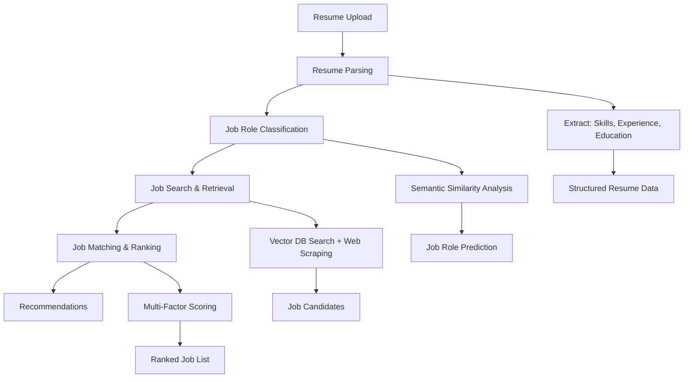

# AI Job Recommendation System

A free, open-source, production-ready system for parsing resumes and recommending matching jobs using AI. Built with **100% free and open-source** technologies - no paid APIs required.

## 🚀 Features

- **Resume Parsing**: Extract structured data from PDF, DOCX, and text resumes using free LLM models (Ollama or HuggingFace)
- **Job Role Classification**: Automatically classify resumes into job roles using semantic similarity
- **Job Search**: Search jobs from multiple free sources (Arbeitnow, RemoteOK, Indeed RSS)
- **Vector Database**: Fast semantic job matching using Chroma (free, local vector database)
- **Multi-Factor Scoring**: Rank jobs based on semantic similarity, skills match, and experience level
- **REST API**: FastAPI-based REST API for easy integration
- **Docker Support**: Ready for deployment with Docker and Docker Compose

## 🛠️ Technology Stack

### Core Technologies (All Free & Open-Source)
- **LLM**: Ollama (local) or HuggingFace Transformers
- **Vector DB**: Chroma (local, persistent)
- **Embeddings**: Sentence Transformers (local)
- **API**: FastAPI
- **PDF Processing**: PyMuPDF
- **Web Scraping**: BeautifulSoup, Requests
- **Caching**: Redis (response caching and rate limiting)
- **Rate Limiting**: SlowAPI with Redis backend

## 📋 Prerequisites

- Python 3.11+
- Docker & Docker Compose (optional, for containerized deployment)
- Ollama (optional, for local LLM - recommended)

## 🔄 System Workflow

### End-to-End Process



### Detailed Workflow

1. **Resume Processing**
   - Upload PDF/DOCX/text resume
   - Extract structured data using LLM
   - Parse skills, experience, education, contact info

2. **Job Role Classification**
   - Analyze resume content semantically
   - Match against known job roles
   - Determine most suitable job categories

3. **Job Search**
   - Query vector database for similar jobs
   - Scrape fresh listings from job boards
   - Deduplicate and filter results

4. **Job Matching**
   - Calculate semantic similarity scores
   - Match skills and experience requirements
   - Rank jobs by overall fit

5. **Recommendations**
   - Return top-k matching jobs
   - Include detailed scoring breakdown
   - Provide job descriptions and requirements

## 🚀 Quick Start

### Option 1: Local Setup

1. **Clone and setup**:
```bash
git clone <repository-url>
cd AI-Job-Recommendation-System
./scripts/setup.sh
```

2. **Configure environment**:
```bash
cp .env.example .env
# Edit .env with your settings
```

3. **Start Ollama** (if using Ollama):
```bash
# Install Ollama: https://ollama.ai
ollama serve
ollama pull llama3.1:8b
```

4. **Run the API**:
```bash
source venv/bin/activate
uvicorn src.api.main:app --reload
```

5. **Ingest jobs** (optional):
```bash
python scripts/ingest_jobs.py
```

### Option 2: Docker Setup

1. **Start services**:
```bash
docker-compose up -d
```

2. **Wait for Redis to be ready**:
```bash
# Check Redis status
docker-compose logs redis
# Should see "Ready to accept connections"
```

3. **Pull Ollama model** (in Ollama container):
```bash
docker exec -it resume_parser_ollama ollama pull llama3.1:8b
```

4. **Ingest jobs**:
```bash
docker exec -it resume_parser_api python scripts/ingest_jobs.py
```

### Option 3: Production Deployment

1. **Build Docker images**:
```bash
docker-compose -f docker-compose.prod.yml build
```

2. **Deploy**:
```bash
docker-compose -f docker-compose.prod.yml up -d
```

3. **Setup monitoring** (optional):
```bash
# Add Prometheus/Grafana for monitoring
docker-compose -f docker-compose.monitoring.yml up -d
```

## 📖 API Usage

### Health Check
```bash
curl http://localhost:8000/health
```

### Parse Resume from File
```bash
curl -X POST "http://localhost:8000/api/parse-resume-file" \
  -H "Content-Type: multipart/form-data" \
  -F "file=@resume.pdf" \
  -F "top_k=10"
```

### Parse Resume from Text
```bash
curl -X POST "http://localhost:8000/api/parse-resume-text" \
  -H "Content-Type: application/json" \
  -d '{
    "resume_text": "John Doe\nSoftware Engineer...",
    "top_k": 10
  }'
```

### Ingest Jobs
```bash
curl -X POST "http://localhost:8000/api/ingest-jobs" \
  -H "Content-Type: application/json" \
  -d '{
    "jobs": [
      {
        "id": "job1",
        "title": "Backend Developer",
        "company": "Tech Corp",
        "description": "...",
        "source": "arbeitnow"
      }
    ]
  }'
```

### API Documentation
Visit `http://localhost:8000/docs` for interactive API documentation.

## 📁 Project Structure

```
AI-RESUME-PARSER-JOB-RECOMMEDER/
├── src/
│   ├── api/              # FastAPI endpoints
│   ├── parsers/          # Resume parsing
│   ├── classifiers/      # Job role classification
│   ├── job_search/       # Job search and matching
│   ├── vector_db/        # Vector database operations
│   ├── utils/            # Utilities (logging, PDF parsing, LLM client)
│   └── pipeline.py       # Main pipeline
├── config/               # Configuration
├── data/                 # Data storage
├── scripts/              # Utility scripts
├── docker/               # Docker files
├── tests/                # Tests
├── requirements.txt      # Python dependencies
├── Dockerfile            # Docker image
├── docker-compose.yml    # Docker Compose config
└── README.md            # This file
```

## ⚙️ Configuration

### LLM Provider Options

**Ollama (Recommended)**:
```env
LLM_PROVIDER=ollama
OLLAMA_BASE_URL=http://localhost:11434
OLLAMA_MODEL=llama3.1:8b
```

**HuggingFace**:
```env
LLM_PROVIDER=huggingface
HF_MODEL=microsoft/Phi-3-mini-4k-instruct
HF_DEVICE=cpu  # or cuda for GPU
```

### Vector Database

Chroma (default, local):
```env
VECTOR_DB_PROVIDER=chroma
CHROMA_PERSIST_DIR=./data/chroma_db
```

### Job Sources

Configure which sources to use:
```env
JOB_SOURCES=arbeitnow,remoteok,indeed
```

## 🔧 Development

### Running Tests
```bash
pytest tests/
```

### Code Formatting
```bash
black src/
isort src/
```

### Adding New Job Sources

1. Add scraper method in `src/job_search/job_scraper.py`
2. Add source name to `JOB_SOURCES` in settings
3. Update `search_all_sources()` method

### Adding New Job Roles

Edit `data/roles.json` or it will be auto-created with defaults.

## 🚢 Deployment

### Docker Deployment

1. Build and run:
```bash
docker-compose up -d
```

2. Wait for all services to be ready:
```bash
# Check service status
docker-compose ps
# All services should show "Up"
```

3. Check logs:
```bash
docker-compose logs -f api
```

### Production Deployment

1. Set environment variables in `.env`
2. Use production WSGI server:
```bash
gunicorn src.api.main:app -w 4 -k uvicorn.workers.UvicornWorker
```

3. Use reverse proxy (Nginx):
```nginx
location / {
    proxy_pass http://localhost:8000;
    proxy_set_header Host $host;
    proxy_set_header X-Real-IP $remote_addr;
}
```

## 📊 Performance

- **Resume Parsing**: ~3-5 seconds (depends on LLM)
- **Job Search**: <1 second (vector DB) or 2-5 seconds (web scraping)
- **Job Ranking**: ~0.5 seconds per job
- **End-to-End**: ~10-20 seconds

## 🔒 Security

- Input validation with Pydantic
- File upload size limits
- CORS configuration
- Environment variable for sensitive data

## 🤝 Contributing

Contributions welcome! Please:
1. Fork the repository
2. Create a feature branch
3. Make your changes
4. Add tests
5. Submit a pull request

## 📝 License

MIT License - see LICENSE file for details

## 🙏 Acknowledgments

- [Ollama](https://ollama.ai) for free local LLM
- [Chroma](https://www.trychroma.com/) for vector database
- [Sentence Transformers](https://www.sbert.net/) for embeddings
- [FastAPI](https://fastapi.tiangolo.com/) for API framework

## 📞 Support

For issues and questions:
- Open an issue on GitHub
- Check the documentation at `/docs` endpoint

---

**Built with ❤️ using 100% free and open-source technologies**
